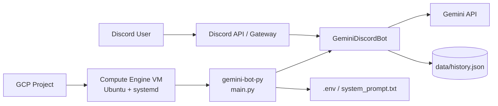
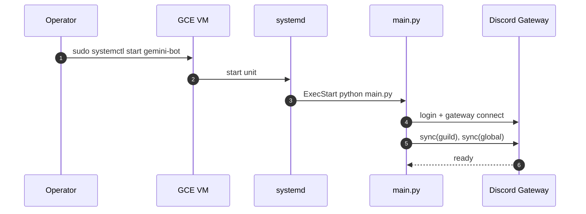
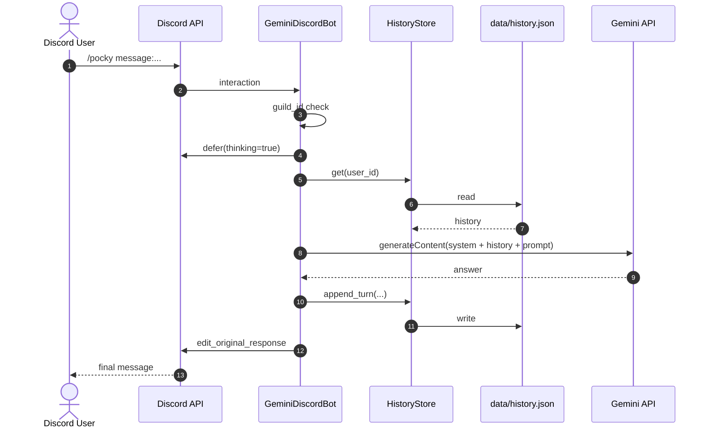

# gemini-bot-py システム仕様書（GCP運用版）

## 1. 文書の目的

本書は `gemini-bot-py` の実装仕様と、GCP（Compute Engine）での常時運用構成を定義する。

## 2. システム全体像

### 2.1 機能要約

- Discord スラッシュコマンド（`/ask`, `/pocky`）を処理
- Gemini API で応答生成（`google_search` ツール有効）
- 会話履歴を `data/history.json` に保存
- 指定サーバー（`DISCORD_SERVER_ID`）以外は実行拒否
- GCP VM 上で `systemd` 常駐運用

### 2.2 GCP込み構成図

## 3. リポジトリ構成と役割

- `main.py`
  - エントリポイント
  - 設定読込、依存初期化、Bot起動
- `bot/config.py`
  - `.env` から設定ロード
  - 必須値検証、`AppConfig` 生成
- `bot/discord_bot.py`
  - `/ask` `/pocky` 登録
  - Interaction処理（defer、履歴、Gemini、返信）
- `bot/gemini_client.py`
  - Gemini `generateContent` 呼び出し
- `bot/history_store.py`
  - JSON履歴の読み書き
- `README.md`
  - GCPデプロイと運用手順
- `tests/test_config.py`, `tests/test_history_store.py`
  - 主要ロジックの最小テスト

## 4. クラス・関数仕様

### 4.1 `main.py`

#### `async_main() -> None`
- 役割: 実行に必要な依存を構築して Bot を開始
- 処理:
  - `load_config()`
  - `system_prompt.txt` の存在/空チェック
  - `HistoryStore`, `GeminiClient`, `GeminiDiscordBot` を生成
  - `bot.start(config.discord_token)`
- 例外:
  - 設定不備で `ConfigError`

#### `main() -> None`
- 役割: 非同期起動のラッパー
- 処理:
  - `asyncio.run(async_main())`
  - `ConfigError` を `SystemExit` に変換

### 4.2 `bot/config.py`

#### `AppConfig`
- 役割: 実行設定の不変オブジェクト
- 主要フィールド:
  - `discord_token: str`
  - `discord_server_id: int`
  - `gemini_api_key: str`
  - `gemini_model: str`
  - `system_prompt_path: Path`
  - `history_path: Path`
  - `max_history_items: int`
  - `family_name_map: dict[str, str]`

#### `ConfigError(RuntimeError)`
- 役割: 設定エラーの専用例外

#### `_required(name: str) -> str`
- 役割: 必須環境変数取得
- 引数: `name`（環境変数名）
- 戻り値: 設定値
- 例外: 未設定時 `ConfigError`

#### `_build_family_map() -> dict[str, str]`
- 役割: `FAMILY_IDxx/FAMILY_NAMExx` から表示名辞書を構築
- 戻り値: `{discord_user_id: display_name}`

#### `load_config() -> AppConfig`
- 役割: `.env` 読み込みと設定生成
- 処理:
  - 必須値検証
  - 任意値にデフォルト設定
  - `MAX_HISTORY_ITEMS >= 2` を保証

### 4.3 `bot/discord_bot.py`

#### `class GeminiDiscordBot(commands.Bot)`

#### `__init__(config, history_store, gemini_client) -> None`
- 役割: Bot初期化
- 処理: Intents最小設定、依存保持

#### `setup_hook() -> None`
- 役割: コマンド登録と同期
- 処理:
  - `/ask`, `/pocky` を登録
  - `copy_global_to(guild=...)`
  - `sync(guild=...)`, `sync()`
  - 同期結果ログ出力

#### `_handle_ask(interaction, message) -> None`
- 役割: コマンド共通処理
- 引数:
  - `interaction: discord.Interaction`
  - `message: str`
- 処理:
  - サーバーID検証
  - `defer(thinking=True)`
  - 表示名解決
  - 履歴取得
  - Gemini応答生成
  - 履歴保存
  - `edit_original_response` で返答
- 例外時:
  - ログ出力
  - `オカメパニック: ...` を返答

#### `_resolve_display_name(user) -> str`
- 役割: 表示名解決
- 優先順位:
  - `family_name_map`
  - `global_name`
  - `name`

#### `_fit_discord_message(content: str) -> str`
- 役割: 2000文字制限に収める
- 戻り値: 必要に応じて末尾 `...` 付き文字列

### 4.4 `bot/gemini_client.py`

#### `class GeminiClient`

#### `__init__(api_key, model, system_prompt, session) -> None`
- 役割: Gemini API 呼び出し依存を保持

#### `generate_response(prompt, history) -> str`
- 役割: Gemini APIから応答取得
- 引数:
  - `prompt: str`
  - `history: list[dict[str, Any]]`
- 処理:
  - `generateContent` に `system_instruction`, `contents`, `tools` を送信
  - HTTP失敗時に `RuntimeError`
- 戻り値:
  - 抽出済み応答テキスト

#### `_extract_text(data) -> str`
- 役割: Geminiレスポンス JSON から本文抽出
- 例外:
  - `candidates` 不在・空本文で `RuntimeError`

### 4.5 `bot/history_store.py`

#### `class HistoryStore`

#### `__init__(path: Path) -> None`
- 役割: 保存先パスと排他制御の初期化

#### `get(user_id: str) -> list[dict[str, Any]]`
- 役割: 履歴取得
- 戻り値: ユーザー履歴（不正時は空配列）

#### `append_turn(user_id, user_prompt, model_response, max_items) -> list[dict[str, Any]]`
- 役割: 1往復追記と件数制限
- 処理:
  - `user`, `model` レコード追加
  - `max_items` へ切り詰め
  - 原子的書き込み
- 戻り値: 更新後履歴

#### `_read() -> dict[str, Any]`
- 役割: JSON読込
- 備考: 未作成/JSON破損で空辞書返却

#### `_write(data: dict[str, Any]) -> None`
- 役割: 一時ファイル経由で安全に保存

## 5. シーケンス図

### 5.1 起動（GCP + systemd）

### 5.2 コマンド実行（/ask, /pocky）

## 6. GCP運用仕様

### 6.1 インフラ要件（推奨）

- Compute Engine: `e2-micro`
- Region: `us-west1` / `us-central1` / `us-east1`
- OS: Ubuntu LTS
- 永続化: VMローカルディスク（`data/history.json`）

### 6.2 サービス管理

- サービス名: `gemini-bot`
- 定義: `/etc/systemd/system/gemini-bot.service`
- 自動再起動: `Restart=always`
- 自動起動: `systemctl enable gemini-bot`

### 6.3 監視

- 稼働確認: `systemctl status gemini-bot`
- ログ監視: `journalctl -u gemini-bot -f`
- 料金監視: GCP Billing Budget Alert

## 7. セキュリティ・運用注意

- `.env`、`system_prompt.txt`、`data/history.json` はGitへ含めない
- APIキー・トークン流出時は即時ローテーション
- `data/history.json` は個人データを含みうるため扱いに注意
- 複数VM運用やスケールアウト時は外部データストアへ移行する
