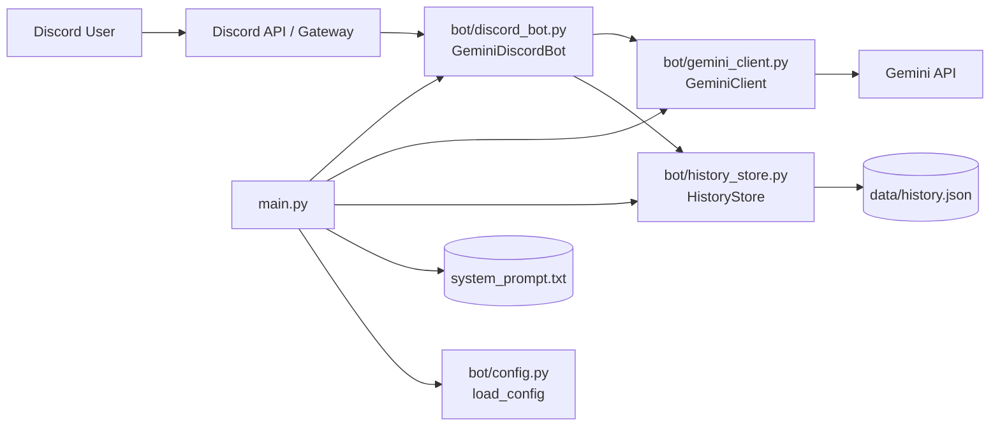
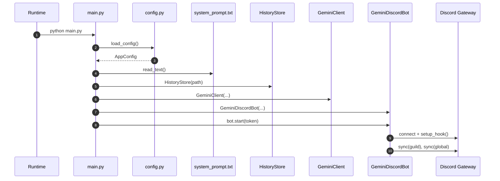
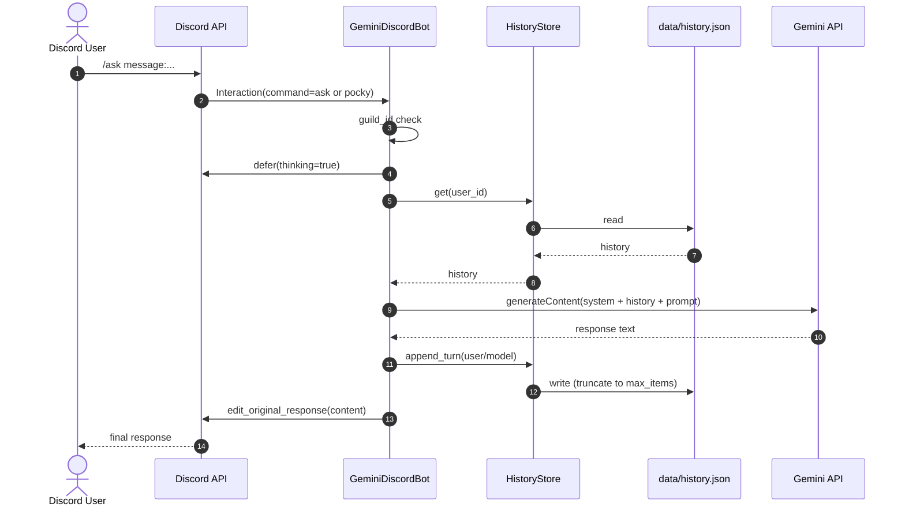

# gemini-bot-py システム仕様書

## 1. 目的
この文書は `gemini-bot-py` の実装構成と処理仕様を定義する。
対象は Python 版 Discord Bot（`discord.py`）で、Gemini API を使った対話応答を行う。

## 2. システム全体像

### 2.1 役割
- Discord からスラッシュコマンド（`/ask`, `/pocky`）を受け取る
- ユーザーごとの会話履歴をローカル JSON に保存する
- Gemini API（`generateContent`）に履歴付きで問い合わせる
- Discord の deferred response を更新して最終応答を返す

### 2.2 構成図（Mermaid）

## 3. ファイル構成と役割
- `main.py`
  - エントリポイント
  - 設定ロード、システムプロンプト検証、依存オブジェクト生成、Bot 起動
- `bot/config.py`
  - `.env` 読み込み
  - 必須/任意設定を `AppConfig` に集約
- `bot/discord_bot.py`
  - Discord スラッシュコマンド登録
  - コマンド処理本体（defer、履歴取得、Gemini 呼び出し、返信更新）
- `bot/gemini_client.py`
  - Gemini `generateContent` 呼び出し
  - API レスポンスからテキスト抽出
- `bot/history_store.py`
  - 会話履歴の読み書き
  - ユーザー単位保存と件数制限
- `tests/test_config.py`
  - `FAMILY_IDxx/FAMILY_NAMExx` のマッピング組み立て検証
- `tests/test_history_store.py`
  - 履歴保持件数（最新 N 件）ロジック検証

## 4. クラス・関数仕様

### 4.1 `main.py`

#### `async_main() -> None`
- 目的: アプリ実行に必要な依存を構築して Bot を起動する
- 主な処理:
  - `load_config()` で設定読込
  - `system_prompt.txt` 存在/空文字チェック
  - `HistoryStore` と `GeminiClient` を生成
  - `GeminiDiscordBot.start()` を実行
- 例外:
  - 設定不備時に `ConfigError` を送出

#### `main() -> None`
- 目的: 非同期エントリポイントのラッパー
- 主な処理:
  - `asyncio.run(async_main())`
  - `ConfigError` を `SystemExit` に変換

### 4.2 `bot/config.py`

#### `AppConfig`
- 目的: 実行設定の不変データ構造
- フィールド:
  - `discord_token: str`
  - `discord_server_id: int`
  - `gemini_api_key: str`
  - `gemini_model: str`
  - `system_prompt_path: Path`
  - `history_path: Path`
  - `max_history_items: int`
  - `family_name_map: dict[str, str]`

#### `ConfigError(RuntimeError)`
- 目的: 設定関連エラーを表す例外型

#### `_required(name: str) -> str`
- 目的: 必須環境変数の取得
- 引数:
  - `name`: 環境変数名
- 戻り値:
  - 設定済みの値
- 例外:
  - 未設定時 `ConfigError`

#### `_build_family_map() -> dict[str, str]`
- 目的: `FAMILY_IDxx` と `FAMILY_NAMExx` を対応付ける
- 入力源:
  - `os.environ`
- 戻り値:
  - `{user_id: display_name}` 形式の辞書

#### `load_config() -> AppConfig`
- 目的: `.env` を読み込んで `AppConfig` を構築
- 主な処理:
  - 必須キー検証（`DISCORD_TOKEN`, `DISCORD_SERVER_ID`, `GEMINI_API_KEY`）
  - 任意値にデフォルト適用
  - `MAX_HISTORY_ITEMS >= 2` のバリデーション

### 4.3 `bot/discord_bot.py`

#### `class GeminiDiscordBot(commands.Bot)`

#### `__init__(config: AppConfig, history_store: HistoryStore, gemini_client: GeminiClient) -> None`
- 目的: Discord Bot 本体初期化
- 主な処理:
  - 必要最小限の Intents（guilds）設定
  - 依存オブジェクト保持

#### `setup_hook() -> None`
- 目的: アプリコマンド登録と同期
- 主な処理:
  - `/ask` と `/pocky` を登録
  - `copy_global_to(guild=...)` で guild へ複製
  - `sync(guild=...)` と `sync()` を実行
  - 同期結果（コマンド名）をログ出力

#### `_handle_ask(interaction: discord.Interaction, message: str) -> None`
- 目的: コマンド共通の応答処理
- 引数:
  - `interaction`: Discord interaction
  - `message`: ユーザー入力
- 主な処理:
  - サーバー ID 制限チェック
  - `defer(thinking=True)`
  - ユーザー表示名決定
  - 履歴取得 `HistoryStore.get()`
  - 生成 `GeminiClient.generate_response()`
  - 履歴保存 `HistoryStore.append_turn()`
  - `edit_original_response()` で返答更新
- 例外時:
  - エラーログ出力
  - `オカメパニック: ...` を返信

#### `_resolve_display_name(user: discord.abc.User) -> str`
- 目的: 表示名の解決
- 優先順位:
  - `family_name_map[user_id]`
  - `user.global_name`
  - `user.name`

#### `_fit_discord_message(content: str) -> str`
- 目的: Discord 文字数上限（2000）への収まり保証
- 処理:
  - 2000 文字超過時は末尾 `...` を付与して切り詰め

### 4.4 `bot/gemini_client.py`

#### `class GeminiClient`

#### `__init__(api_key: str, model: str, system_prompt: str, session: aiohttp.ClientSession) -> None`
- 目的: Gemini API 呼び出しの依存保持

#### `generate_response(prompt: str, history: list[dict[str, Any]]) -> str`
- 目的: Gemini API から応答文を取得
- 引数:
  - `prompt`: 今回のユーザー入力（表示名付き）
  - `history`: 既存会話履歴
- 処理:
  - `POST /v1beta/models/{model}:generateContent`
  - `system_instruction`, `contents`, `tools:[{google_search:{}}]` を送信
  - HTTPエラー時は `RuntimeError`
  - `_extract_text()` で本文抽出

#### `_extract_text(data: dict[str, Any]) -> str`
- 目的: Gemini レスポンス JSON からテキストを抽出
- 処理:
  - `candidates[0].content.parts[].text` を連結
  - 取得不能時は `RuntimeError`

### 4.5 `bot/history_store.py`

#### `class HistoryStore`

#### `__init__(path: Path) -> None`
- 目的: 履歴ファイルパスと排他制御（`asyncio.Lock`）を初期化

#### `get(user_id: str) -> list[dict[str, Any]]`
- 目的: ユーザー履歴取得
- 戻り値:
  - 履歴配列（不正データ時は空配列）

#### `append_turn(user_id: str, user_prompt: str, model_response: str, max_items: int) -> list[dict[str, Any]]`
- 目的: 1往復分（user/model）を追加して保存
- 処理:
  - 履歴に `user`, `model` を追加
  - 末尾 `max_items` 件に切り詰め
  - ファイルへ原子的に書き込み
- 戻り値:
  - 更新後履歴

#### `_read() -> dict[str, Any]`
- 目的: 履歴ファイル読み込み
- 備考:
  - 未作成または JSON 不正時は空辞書を返す

#### `_write(data: dict[str, Any]) -> None`
- 目的: 履歴ファイル書き込み
- 処理:
  - 一時ファイルに書き出し後 `replace` で置換

## 5. 処理シーケンス（Mermaid）

### 5.1 起動シーケンス

### 5.2 `/ask` or `/pocky` 実行シーケンス

## 6. 環境変数
- 必須
  - `DISCORD_TOKEN`
  - `DISCORD_SERVER_ID`
  - `GEMINI_API_KEY`
- 任意
  - `GEMINI_MODEL`（default: `gemini-2.5-flash`）
  - `SYSTEM_PROMPT_PATH`（default: `system_prompt.txt`）
  - `HISTORY_PATH`（default: `data/history.json`）
  - `MAX_HISTORY_ITEMS`（default: `10`）
  - `FAMILY_IDxx` / `FAMILY_NAMExx`

## 7. 既知の運用ポイント
- スラッシュコマンド切替時は Discord クライアント再起動や再同期が必要な場合がある
- 本実装はローカル JSON 永続化のため、複数プロセス/複数ホスト共有には外部ストアが必要
